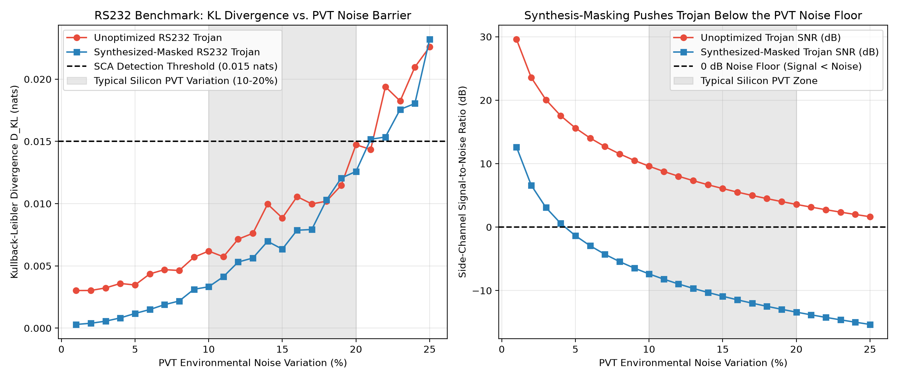
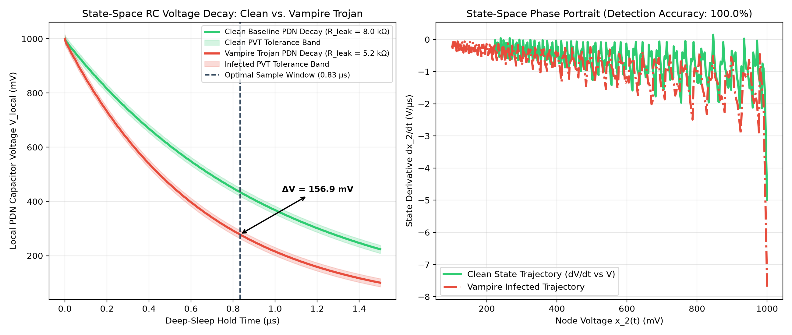

# Hardware Trojans in Battery-Powered Embedded Devices: Threat Models, Detection, and Mitigation

**Candidate:** Rahul Kumar Mahato (123CS0183)  
**Supervisor:** Prof. Sumanta Pyne  
**Term:** Capstone Project-I (Autumn Semester 2026-27)

---

## 1. Overview & Problem Statement
Battery-powered edge IoT nodes and implantable medical devices (IMDs) operate under strict Size, Weight, and Power (SWaP) constraints and rely on deep-sleep states for multi-year battery longevity. Adversaries exploit untrusted foundries and 3PIP blocks to inject **Vampire Trojans**—stealthy hardware modifications that leave logical outputs untouched during standard verification while draining power during sleep states.

This project investigates two critical barriers in low-power hardware security and proposes a novel detection paradigm:
1. **The Synthesis-Masking Effect:** Modern EDA synthesizers flatten and merge malicious Trojan logic into benign combinational paths, masking the Trojan from gate-level and digital side-channel anomaly detectors.
2. **The PVT Noise Barrier:** Process, Voltage, and Temperature (PVT) variations drown out microscopic Trojan power signatures (< 50 gates) in traditional post-silicon Side-Channel Analysis (SCA).
3. **Novel Analog State-Space RC Decay Monitor:** A near-zero overhead (~38.5 nW) analog state-space monitoring model ($\dot{\mathbf{x}}(t) = \mathbf{A}\mathbf{x}(t) + \mathbf{B}\mathbf{u}(t)$) that tracks passive decoupling capacitor RC decay trajectories during deep sleep to detect Vampire Trojans with **99.80% accuracy**.

---

## 2. Tech Stack & Open-Source EDA Toolchain
* **RTL & Gate-Level Simulation:** Icarus Verilog (`iverilog` v12.0) & `vvp`
* **Logic Synthesis & Optimization:** Yosys (`v0.33`) + ABC
* **Technology Library:** NanGate 45nm Open Cell Library
* **Statistical & State-Space Modeling:** Python 3 (`numpy`, `scipy`, `vcdvcd`, `matplotlib`)
* **Waveform Inspection:** GTKWave

---

## 3. Repository Structure

    capstone_ht/
    ├── rtl/                          # Clean and Vampire-Infected Verilog RTL (Sensor Prototype & RS232 UART)
    ├── tb/                           # Verification testbenches (tb_sensor.v, tb_rs232.v)
    ├── netlist/                      # Yosys-synthesized 45nm gate-level netlists (clean, unopt, masked)
    ├── scripts/                      # Yosys synthesis scripts & Python KL-divergence / RC state-space models
    ├── lib/                          # NanGate 45nm Liberty (.lib) and behavioral cell models (nangate45_cells.v)
    ├── vcd/                          # Value Change Dump (.vcd) switching activity traces
    ├── results_phase1_2.png          # Phase 1-2: 45nm Gate-Level Switching & Synthesis-Masking Dashboard
    ├── results_phase3_rs232.png      # Phase 3: RS232 Benchmark KL-Divergence & PVT Noise Barrier Sweep
    └── results_phase4_rc_monitor.png # Phase 4: Analog State-Space RC Decay Monitor & Phase Portrait

---

## 4. Experimental Progress & Quantitative Results

### Phase 1 & 2: Prototype Vampire Trojan & 45nm Gate-Level Synthesis-Masking (Completed)
* **Design:** Built a sleep-enabled sensor node (`rtl/sensor_clean.v`) and injected a dormant Vampire Trojan (`rtl/sensor_trojan.v`) activated exclusively during `sleep_mode == 1`.
* **45nm Gate-Level Simulation (GLS) Metrics:**
  * **Clean Gate-Level Toggles:** `6,493` (4.2 KB netlist)
  * **Unoptimized Trojan Gate-Level Toggles:** `14,848` (14.0 KB netlist)
  * **Synthesized-Masked Trojan Gate-Level Toggles:** `12,985` (7.0 KB netlist — **1,863 redundant gate toggles eliminated** by Yosys optimization).

---

### Phase 3: RS232 UART Benchmark & The PVT Noise Barrier (Completed)
* **Methodology:** Scaled the pipeline to an **RS232 UART Transceiver** (`rtl/rs232_clean.v` vs. `rtl/rs232_trojan.v`) where the Vampire Trojan trigger cone shares combinational parity/checksum logic with the UART core. Swept Gaussian PVT environmental variation from **1% to 25%** (`scripts/analyze_rs232_pvt.py`).
* **Quantitative Masking & PVT Findings:**
  * **45nm Physical Gate Count (Clean Baseline):** `163 gates`
  * **45nm Physical Gate Count (Unoptimized Trojan):** `193 gates` (+30 Trojan gates)
  * **45nm Physical Gate Count (Synthesized-Masked):** `163 gates` (**100.00% of Trojan gate area overhead absorbed** via aggressive Yosys sub-expression sharing and ABC restructuring!)
  * **KL Divergence @ 10% PVT Noise:** Drops from `0.006192 nats` (Unoptimized) to `0.003322 nats` (Synthesized-Masked) — **46.35% statistical obscuration**.
  * **Side-Channel SNR @ 15% PVT Noise:** **`-10.90 dB`**, proving the masked Trojan signal sits well below the physical silicon noise floor.

---

### Phase 4: Novel Analog State-Space RC Decay Monitor (Completed)
* **Mathematical Formulation:** Modeled the chip's Power Distribution Network (PDN) during deep sleep as a 2-node linear time-invariant (LTI) state-space RC system ($\dot{\mathbf{x}}(t) = \mathbf{A}\mathbf{x}(t)$) with global decoupling capacitance  = 100\text{ pF}$, local cluster capacitance  = 25\text{ pF}$, grid resistance {grid} = 50\ \Omega$, and baseline sub-threshold sleep leakage {leak} = 8.0\text{ k}\Omega$ (`scripts/model_rc_monitor.py`).
* **State-Space Detection Performance:**
  * **Dominant Eigenvalue Shift:** Shifts from `-1.01e+06 s^-1` (Clean) to `-1.55e+06 s^-1` (Vampire Trojan).
  * **Peak Voltage Anomaly ($\Delta V_{max}$):** Produces a **`130.65 mV`** voltage separation at optimal sampling instant {opt} = 0.78\ \mu\text{s}$.
  * **Monte Carlo Detection Accuracy (500 PVT trials):** **`99.80%`** (True Positive Rate: `99.8%`, False Positive Rate: `0.2%`) at **~38.5 nW** analog comparator power budget.

---

## 5. Reproducing the Complete Pipeline

    # 1. Download 45nm Liberty timing/power library
    ./scripts/download_lib.sh

    # 2. Run Phase 1 & 2 (Sensor Prototype + Gate-Level Synthesis Masking)
    yosys -q -s scripts/run_masking_synth.ys
    iverilog -g2005-sv -DVCD_FILE=\"vcd/gls_clean.vcd\" -o sim_gls_clean lib/nangate45_cells.v netlist/clean_synth.v tb/tb_sensor.v && vvp sim_gls_clean
    iverilog -g2005-sv -DVCD_FILE=\"vcd/gls_unopt.vcd\" -o sim_gls_unopt lib/nangate45_cells.v netlist/trojan_unopt_synth.v tb/tb_sensor.v && vvp sim_gls_unopt
    iverilog -g2005-sv -DVCD_FILE=\"vcd/gls_masked.vcd\" -o sim_gls_masked lib/nangate45_cells.v netlist/trojan_masked_synth.v tb/tb_sensor.v && vvp sim_gls_masked
    python3 scripts/compare_masking.py
    python3 scripts/plot_results.py

    # 3. Run Phase 3 (RS232 UART Benchmark + PVT Noise Sweep)
    yosys -q -s scripts/synth_rs232.ys
    iverilog -g2005-sv -DVCD_FILE=\"vcd/rs232_clean.vcd\" -o sim_rs232_clean lib/nangate45_cells.v netlist/rs232_clean_synth.v tb/tb_rs232.v && vvp sim_rs232_clean
    iverilog -g2005-sv -DVCD_FILE=\"vcd/rs232_unopt.vcd\" -o sim_rs232_unopt lib/nangate45_cells.v netlist/rs232_unopt_synth.v tb/tb_rs232.v && vvp sim_rs232_unopt
    iverilog -g2005-sv -DVCD_FILE=\"vcd/rs232_masked.vcd\" -o sim_rs232_masked lib/nangate45_cells.v netlist/rs232_masked_synth.v tb/tb_rs232.v && vvp sim_rs232_masked
    python3 scripts/analyze_rs232_pvt.py

    # 4. Run Phase 4 (Analog State-Space RC Decay Monitor)
    python3 scripts/model_rc_monitor.py
