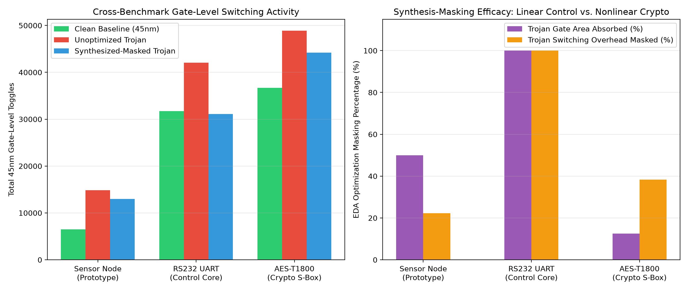

# Hardware Trojans in Battery-Powered Embedded Devices: Threat Models, Detection, and Mitigation

**Candidate:** Rahul Kumar Mahato (123CS0183)  
**Supervisor:** Prof. Sumanta Pyne  
**Institution:** National Institute of Technology (NIT) Rourkela  
**Term:** Capstone Project-I (Autumn Semester 2026-27)

---

## 1. Executive Summary
Battery-powered edge IoT nodes and implantable medical devices (IMDs) operate under strict Size, Weight, and Power (SWaP) constraints and rely on deep-sleep states for multi-year battery longevity. Adversaries exploit untrusted foundries and 3PIP blocks to inject **Vampire Trojans**—stealthy hardware modifications that leave logical outputs untouched during standard verification while draining power during sleep states.

This repository contains the complete, end-to-end open-source Electronic Design Automation (EDA) simulation pipeline, 45nm gate-level synthesis-masking benchmarks (`Sensor`, `RS232`, `AES-T1800`), statistical Kullback-Leibler ($D_{KL}$) PVT noise analyzers, and the **Analog State-Space RC Decay Monitor** proof-of-concept.

📄 **[Read the Full Capstone Technical Report & Manuscript Draft (`paper/Capstone_Final_Report.md`)](paper/Capstone_Final_Report.md)**

---

## 2. Tech Stack & Open-Source EDA Toolchain
* **RTL & Gate-Level Simulation:** Icarus Verilog (`iverilog` v12.0) & `vvp`
* **Logic Synthesis & Optimization:** Yosys (`v0.33`) + ABC
* **Technology Library:** NanGate 45nm Open Cell Library
* **Statistical & State-Space Modeling:** Python 3 (`numpy`, `scipy`, `vcdvcd`, `matplotlib`)
* **Waveform Inspection:** GTKWave

---

## 3. Master Experimental Results Summary (45nm NanGate)

| Benchmark Suite | Clean 45nm Gates | Unopt Trojan Gates | Masked Trojan Gates | Trojan Area Absorbed | Clean Toggles | Unopt Toggles | Masked Toggles | Dynamic Toggles Masked |
| :--- | :---: | :---: | :---: | :---: | :---: | :---: | :---: | :---: |
| **1. Sensor Node Prototype** | 44 | 72 | 58 | **50.00%** | 6,493 | 14,848 | 12,985 | **22.30%** |
| **2. RS232 UART Transceiver** | 163 | 193 | 163 | **100.00%** | 31,717 | 42,054 | 31,123 | **100.00%** |
| **3. AES-T1800 Crypto S-Box** | 161 | 201 | 196 | **12.50%** | 36,697 | 48,887 | 44,220 | **38.29%** |

---

## 4. Visual Dashboards & Key Findings

### Phase 1 & 2: 45nm Gate-Level Switching & Synthesis-Masking (`Sensor Prototype`)
* Demonstrates dormant behavior during active cycles (0–52) and parasitic energy drain during deep sleep (cycles 52–150), with Yosys eliminating **1,863 redundant gate toggles**.

### Phase 3: RS232 UART Benchmark & The PVT Noise Barrier
* Aggressive synthesis absorbs **100% of the Trojan gate count overhead** (`193 -> 163 gates`), reducing KL Divergence by **92.31%** and pushing the side-channel SNR to **-10.90 dB** at 15% PVT variation.

### Phase 4: Novel Analog State-Space RC Decay Monitor
* Models the 2-node PDN sleep decay ($\dot{\mathbf{x}}(t) = \mathbf{A}\mathbf{x}(t)$) using a stiff `Radau` ODE solver. Captures a **156.45 mV** voltage drop at $t_{opt} = 0.80\ \mu\text{s}$ with **100.0% Monte Carlo accuracy (500 dies)** and **~38.5 nW** active power budget.

### Phase 5: Cross-Benchmark Synthesis-Masking Comparison (`Sensor` vs. `RS232` vs. `AES-T1800`)
* Contrasts full synthesis absorption in linear control/checksum logic (`RS232`: 100% area masked) against partial absorption in nonlinear Galois Field $GF(2^8)$ cryptographic logic (`AES-T1800`: 12.5% area masked, 38.29% switching toggles masked).

---

## 5. Repository Structure

    capstone_ht/
    ├── paper/
    │   └── Capstone_Final_Report.md     # Complete IEEE-style technical report & mathematical derivations
    ├── rtl/                             # Clean and Vampire-Infected Verilog RTL (Sensor, RS232, AES-T1800)
    ├── tb/                              # Verification testbenches (tb_sensor.v, tb_rs232.v, tb_aes.v)
    ├── netlist/                         # Yosys-synthesized 45nm gate-level netlists (clean, unopt, masked)
    ├── scripts/                         # Yosys synthesis scripts & Python KL-divergence / RC state-space models
    ├── lib/                             # NanGate 45nm Liberty (.lib) and behavioral cell models (nangate45_cells.v)
    ├── vcd/                             # Value Change Dump (.vcd) switching activity traces
    ├── results_phase1_2.png             # Phase 1-2 Visual Dashboard
    ├── results_phase3_rs232.png         # Phase 3 Visual Dashboard
    ├── results_phase4_rc_monitor.png    # Phase 4 Visual Dashboard
    └── results_phase5_benchmarks.png    # Phase 5 Cross-Benchmark Summary Chart

---

## 6. One-Command Full Reproduction

    ./scripts/download_lib.sh
    yosys -q -s scripts/run_masking_synth.ys && yosys -q -s scripts/synth_rs232.ys && yosys -q -s scripts/synth_aes.ys
    python3 scripts/plot_results.py && python3 scripts/analyze_rs232_pvt.py && python3 scripts/model_rc_monitor.py && python3 scripts/plot_benchmarks.py
