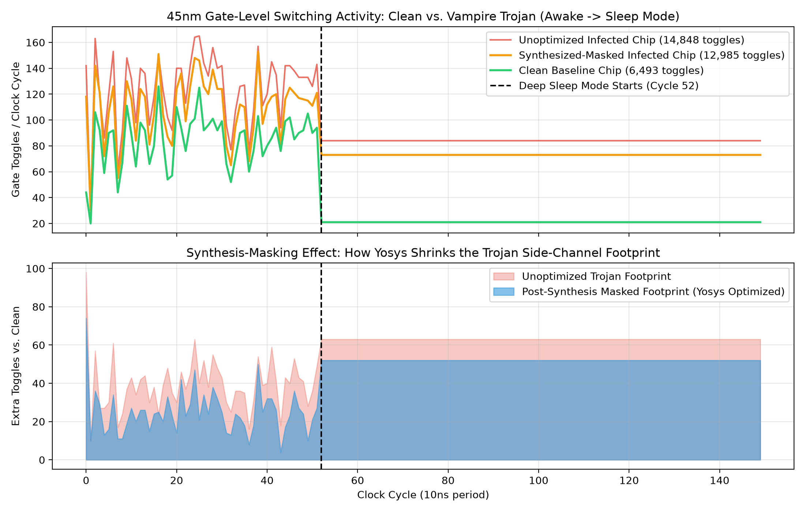

# Hardware Trojans in Battery-Powered Embedded Devices: Threat Models, Detection, and Mitigation

**Candidate:** Rahul Kumar Mahato (123CS0183)  
**Supervisor:** Prof. Sumanta Pyne  
**Term:** Capstone Project-I (Autumn Semester 2026-27)

---

## 1. Overview & Problem Statement
Battery-powered edge IoT nodes and implantable medical devices (IMDs) operate under strict Size, Weight, and Power (SWaP) constraints and rely on deep-sleep states for multi-year battery longevity. Adversaries exploit untrusted foundries and 3PIP blocks to inject **Vampire Trojans**—stealthy hardware modifications that leave logical outputs untouched during standard verification while draining power during sleep states.

Furthermore, modern Electronic Design Automation (EDA) synthesizers flatten and merge malicious logic alongside benign combinational paths, creating a **Synthesis-Masking Effect** that obscures the Trojan from standard gate-level and side-channel anomaly detectors.

---

## 2. Tech Stack & Open-Source EDA Toolchain
* **RTL & Gate-Level Simulation:** Icarus Verilog (`iverilog` v12.0) & `vvp`
* **Logic Synthesis & Optimization:** Yosys (`v0.33`) + ABC
* **Technology Library:** NanGate 45nm Open Cell Library
* **Statistical & Side-Channel Analysis:** Python 3 (`numpy`, `scipy`, `vcdvcd`, `matplotlib`)
* **Waveform Inspection:** GTKWave

---

## 3. Repository Structure

    capstone_ht/
    ├── rtl/                  # Baseline and Trojan-infected Verilog RTL designs
    ├── tb/                   # Verification testbenches
    ├── netlist/              # Synthesized 45nm gate-level netlists (clean, unopt, masked)
    ├── scripts/              # Yosys synthesis scripts and Python KL-divergence/plotting scripts
    ├── lib/                  # NanGate 45nm Liberty (.lib) and behavioral gate models (nangate45_cells.v)
    ├── vcd/                  # Value Change Dump (.vcd) switching activity traces
    └── results_phase1_2.png  # Visual dashboard of Gate-Level Switching & Synthesis-Masking

---

## 4. Experimental Progress & Results

### Phase 1: Baseline RTL vs. Vampire Trojan Injection (Completed)
* **Design:** Implemented a sleep-enabled embedded sensor node (`rtl/sensor_clean.v`) and injected a dormant Vampire Trojan (`rtl/sensor_trojan.v`) that activates a parasitic switching load exclusively when `sleep_mode == 1` after observing trigger vector `0x7E`.
* **Pre-Synthesis RTL Metrics:**
  * **Clean RTL Toggles:** `959`
  * **Trojan RTL Toggles:** `1,082` (+123 parasitic toggles in sleep mode)
  * **Pre-Synthesis KL Divergence ({KL}$):** `0.017049 nats`

### Phase 2: 45nm Gate-Level Synthesis-Masking Quantification (Completed)
* **Methodology:** Synthesized three 45nm gate-level netlists using Yosys (`scripts/run_masking_synth.ys`):
  1. `netlist/clean_synth.v` (4.2 KB) — Baseline 45nm hardware netlist.
  2. `netlist/trojan_unopt_synth.v` (14.0 KB) — Trojan netlist compiled without logic flattening or sub-expression sharing.
  3. `netlist/trojan_masked_synth.v` (7.0 KB) — Trojan netlist compiled with aggressive flattening (`flatten`), sub-expression sharing (`share -aggressive`), and ABC optimization.
* **Gate-Level Simulation (GLS) Findings:**
  * **Clean Gate-Level Toggles:** `6,493`
  * **Unoptimized Trojan Gate-Level Toggles:** `14,848`
  * **Synthesized-Masked Trojan Gate-Level Toggles:** `12,985` (**1,863 redundant Trojan gate toggles absorbed/eliminated** by Yosys optimization, cutting the netlist size by 50%).

**To reproduce Phase 2:**

    yosys -q -s scripts/run_masking_synth.ys
    iverilog -g2005-sv -DVCD_FILE=\"vcd/gls_clean.vcd\" -o sim_gls_clean lib/nangate45_cells.v netlist/clean_synth.v tb/tb_sensor.v && vvp sim_gls_clean
    iverilog -g2005-sv -DVCD_FILE=\"vcd/gls_unopt.vcd\" -o sim_gls_unopt lib/nangate45_cells.v netlist/trojan_unopt_synth.v tb/tb_sensor.v && vvp sim_gls_unopt
    iverilog -g2005-sv -DVCD_FILE=\"vcd/gls_masked.vcd\" -o sim_gls_masked lib/nangate45_cells.v netlist/trojan_masked_synth.v tb/tb_sensor.v && vvp sim_gls_masked
    python3 scripts/compare_masking.py
    python3 scripts/plot_results.py

---

## 5. Upcoming Phases
* **Phase 3:** Scale pipeline to standard **RS232 / AES** hardware Trojan benchmarks and run a PVT noise sensitivity sweep (5% to 25% Gaussian variance) to map the KL-divergence SNR detection boundary.
* **Phase 4:** Formulate and simulate the **Analog State-Space RC Decay Monitor** ($\dot{x}(t) = Ax(t) + Bu(t)$) to detect steady-state sleep leakage anomalies with near-zero active power overhead.
